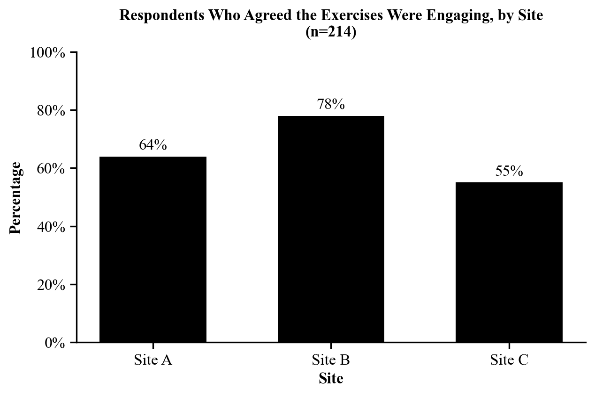

Your Appendices section will contain Appendix I, II, III, and depending on your
project, Appendix IV and V. If you do not have disaggregated graphs or open-ended
responses, take out Appendix IV or V from the Table of Contents as necessary.

::: {.callout-note}
Appendices are very customized to each individual project. Be sure to discuss
with your UCA what your appendices might look like specific to your project.
:::

::: {.callout-note title="About these examples"}
The examples below use **sample data**. Skills Win Coaching Organization is a real
Syracuse University program, but the survey, responses, and numbers shown here are
invented for teaching purposes and are not actual SWCO results.
:::

## Appendix I -- Research Questions

Appendix I shows the questions you are aiming to answer through your project. If
you conducted a survey, this section will contain screenshots of your survey. If
your project is related to data collection or analysis, you will paste your
research questions into this section.

If your project is a survey, take a screenshot of your survey (whether it's a
paper survey or digital survey) and insert your screenshot(s) into Appendix I.
Make sure your screenshot includes all questions asked in your survey.

If your project is not a survey, directly paste your research questions into
Appendix I, like this:

1. How helpful did students find the site session coaches?
2. How engaging did students find the site session exercises?
3. Did student views on the exercises differ by site?
4. What do students feel could be improved about the site sessions?
5. How many sessions did students attend over the semester?
6. Would students recommend the site sessions to a friend?
7. Which session topics did students find most useful?

## Appendix II -- Data Frequencies

Appendix II shows the number (or percentage) of times a specific response or
category appears within your dataset. In effect, it is a list of frequency tables
for each variable analyzed in your report.

Data frequencies for a survey question:

> *The coaches were helpful.*

| Response | Number | Percentage |
|----------|--------|------------|
| Strongly agree | 89 | 42% |
| Agree | 63 | 29% |
| Neutral | 44 | 21% |
| Disagree | 12 | 6% |
| Strongly disagree | 5 | 2% |
| No response | 1 | <1% |

Data frequencies for a data-collection project might look like:

> *Sessions delivered by site, Fall 2026*

| Category | Number | Percentage |
|----------|--------|------------|
| Site A | 14 | 39% |
| Site B | 12 | 33% |
| Site C | 10 | 28% |

## Appendix III -- Codebook and Spreadsheet

Appendix III is your Codebook and Spreadsheet. Your spreadsheet must contain your
coded data (not the raw data). If your spreadsheet contains open-ended responses,
leave the open-ended responses as is. See the
[Codebook and Spreadsheet Guide](codebook-and-spreadsheet.qmd)
for how to build both.

| Column | Field Name | Definition | Code |
|--------|-----------|------------|------|
| A | ID | Respondent's unique identification number | Code is identical to identification number |
| B | SITE | Which site session did you attend? | 1 = Site A ... |
| C | GRADE | What grade are you in? | 1 = 9th ... |
| D | COACH | The coaches were helpful. | 1 = Strongly disagree ... |
| E | ENGAGE | The exercises were engaging. | 1 = Strongly disagree ... |
| F | IMPROVE | What could be improved at your site sessions? | Open ended response: ... |

| ID | SITE | GRADE | COACH | ENGAGE | IMPROVE |
|----|------|-------|-------|--------|---------|
| 1  | 1 | 3 | 5 | 4 | 1 |
| 2  | 2 | 4 | 4 | 5 | 2 |
| 3  | 1 | 2 | 3 | 3 | 1 |
| 4  | 3 | 4 | 5 | 2 | 3 |

## Appendix IV -- Open-Ended Responses

You will only have Appendix IV if you have open-ended questions in your survey.
In this section, you will copy open-ended responses and paste them into the
section. Do not correct any spelling or grammatical errors -- the responses
should be copied as they were originally written. See the
[Qualitative Coding Guide](qualitative-coding.qmd).

> *What could be improved at your site sessions?*

**More activities (n=8)**

1. More hands on activities would be good.
2. add more group activities
3. More activities like the resume one.
4. i liked the practice interviews, do more of those

**More time (n=6)**

1. The sessions felt rushed at the end.
2. more time for each activity
3. Longer sessions.
4. We needed more time to finish.

**Smaller groups (n=4)**

1. The groups were too big.
2. smaller groups so everyone can talk
3. Too many people at my table.
4. Smaller groups would help.

**Better materials (n=3)**

1. The handouts were hard to read.
2. better worksheets
3. The packet had typos in it.

**Nothing (n=2)**

1. Nothing, it was great.
2. nothing

## Appendix V -- Disaggregated Graphs

You will only have Appendix V if your responses require disaggregated graphs.

Disaggregated graphs are used when you need to display how different subgroups
within a population perform or behave. For example, disaggregating test scores by
gender, age, or ethnicity to reveal patterns that may not be apparent when the
data is aggregated.

Paste your disaggregated graphs into Appendix V with a source below each graph.

{fig-alt="Vertical bar graph titled Respondents Who Agreed the Exercises Were Engaging, by Site, n equals 214, with solid black bars for Site A, Site B, and Site C."}

**Source:** Sample data collected and analyzed by Jordan Alvarez for the Skills Win Coaching Organization, Community Link Project, November 2026.
