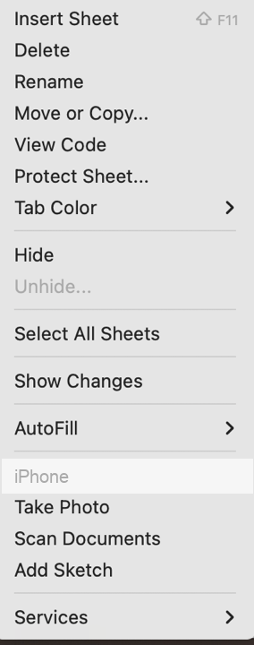
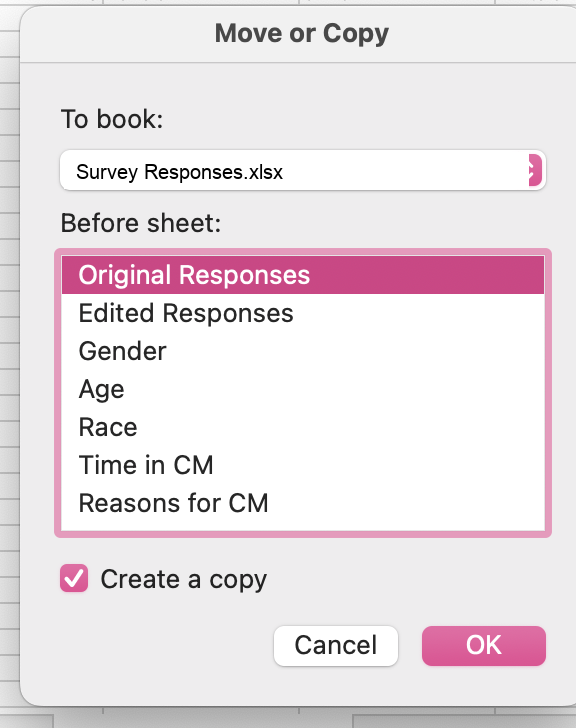

::: {.callout-note title="About these examples"}
The examples below use **sample data**. Skills Win Coaching Organization is a real
Syracuse University program, but the survey, variables, and responses shown here are
invented for teaching purposes and are not actual SWCO results.
:::

## Creating your codebook

**Step 1:** In Word, create a table with four columns: **Column**, **Field Name**,
**Definition**, and **Code**.

| Column | Field Name | Definition | Code |
|--------|-----------|------------|------|
|  |  |  |  |

The number of rows depends on the number of questions you have on your survey or
how many research questions you have. As a general rule:

> Number of questions + 2 = Number of rows in your codebook table

The +2 rows account for the header row and the respondent ID row.

**Step 2:** Create a list of variables from your questions. These will be your
Field Name and Definition columns.

- Your **field name** should be a short word or a few letters describing the
  variable. *(Example: grade level = GRADE, or engagement = ENGAGE.)*
- Your **definition** should be the original question or a description of the
  variable. *(Example: "What grade are you in?" or "Code is identical to the
  respondent's ID number.")*

| Column | Field Name | Definition | Code |
|--------|-----------|------------|------|
| A | ID | Respondent's unique identification number | Code is identical to identification number |
| B | SITE | Which site session did you attend? |  |
| C | GRADE | What grade are you in? |  |

*Note: each field name (variable) aligns with a column of your spreadsheet
according to your codebook.*

**Step 3:** Repeat step 2 for all of your questions.

| Column | Field Name | Definition | Code |
|--------|-----------|------------|------|
| A | ID | Respondent's unique identification number | Code is identical to identification number |
| B | SITE | Which site session did you attend? |  |
| C | GRADE | What grade are you in? |  |
| D | COACH | The coaches were helpful. |  |
| E | ENGAGE | The exercises were engaging. |  |
| F | IMPROVE | What could be improved at your site sessions? |  |

**Step 4:** Assign a code to each possible answer for each question. Your
variable type will make a difference here.

*Note: for open-ended responses, you should create up to 5 or 6 categories to
place the open-ended responses into. See the
[Qualitative Coding Guide](qualitative-coding.qmd).*

**Step 5:** In your spreadsheet, you will use your codebook to code your raw
data.

## Codebook example

| Column | Field Name | Definition | Code |
|--------|-----------|------------|------|
| A | ID | Respondent's unique identification number | Code is identical to identification number |
| B | SITE | Which site session did you attend? | 1 = Site A 2 = Site B 3 = Site C 99 = No response |
| C | GRADE | What grade are you in? | 1 = 9th 2 = 10th 3 = 11th 4 = 12th 99 = No response |
| D | COACH | The coaches were helpful. | 1 = Strongly disagree 2 = Disagree 3 = Neutral 4 = Agree 5 = Strongly agree 99 = No response |
| E | ENGAGE | The exercises were engaging. | 1 = Strongly disagree 2 = Disagree 3 = Neutral 4 = Agree 5 = Strongly agree 99 = No response |
| F | IMPROVE | What could be improved at your site sessions? | Open ended response: 1 = More activities 2 = More time 3 = Smaller groups 4 = Better materials 5 = Nothing 99 = No response |

## Creating your spreadsheet

**Step 6:** Once you have created your codebook, it is time to code your data in
Excel using the codes you just created above.

*Why do we do this? By coding your data, it will make your data far easier to
comprehend and to analyze.*

**Step 7:** Open a new Excel spreadsheet. Begin by typing the field names for
each of your variables from your codebook into the first row of the sheet.

| ID | SITE | GRADE | COACH | ENGAGE | IMPROVE |
|----|------|-------|-------|--------|---------|
|    |      |       |       |        |         |

**Step 8:** Save this Excel spreadsheet and turn it in along with your Codebook
document and Revised Executive Summary for your assignment.

## Once you have your data

**Step 9:** Copy your data into your spreadsheet and create a copy of your
responses. You want to save an original version of your data along with the coded
data. You can create a copy by right-clicking on the spreadsheet tab, selecting
"Move or Copy," and selecting to copy. This will create a new tab with the same
data -- name these tabs "Original Responses" and "Coded Responses" to ensure
these don't get mixed up.

::: {layout-ncol=2}
{fig-alt="The Excel sheet-tab context menu with Move or Copy listed among the options."}

{fig-alt="The Excel Move or Copy dialog with a workbook selected and the Create a copy checkbox ticked."}
:::

**Step 10:** Once you have a copy of your responses to edit, you should start
coding all of the responses based on your codebook. Coding will look different
depending on your types of variables. Ask your UCA any questions about specific
variables.

Coded data looks like this -- every answer replaced by its code from the codebook:

| ID | SITE | GRADE | COACH | ENGAGE | IMPROVE |
|----|------|-------|-------|--------|---------|
| 1  | 1 | 3 | 5 | 4 | 1 |
| 2  | 2 | 4 | 4 | 5 | 2 |
| 3  | 1 | 2 | 3 | 3 | 1 |
| 4  | 3 | 4 | 5 | 2 | 3 |
| 5  | 2 | 3 | 4 | 5 | 5 |
| 6  | 1 | 1 | 2 | 3 | 2 |
| 7  | 3 | 2 | 5 | 4 | 99 |

*Hint: use the Find and Replace feature in Excel to quickly code multiple-choice
variables.*
