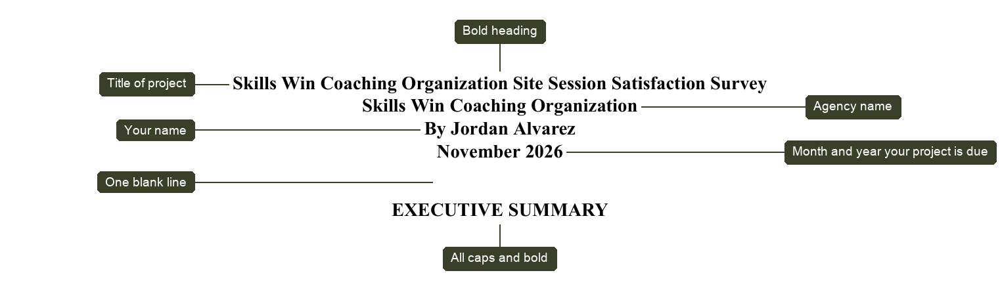
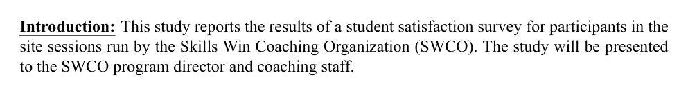
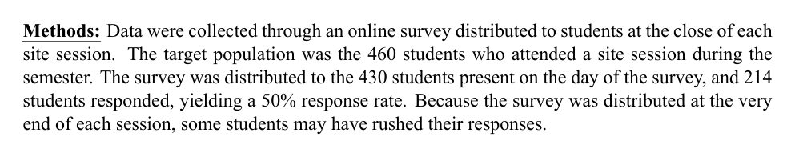
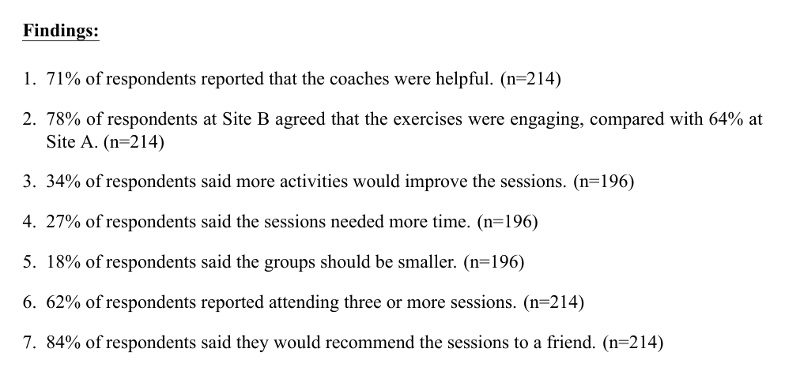
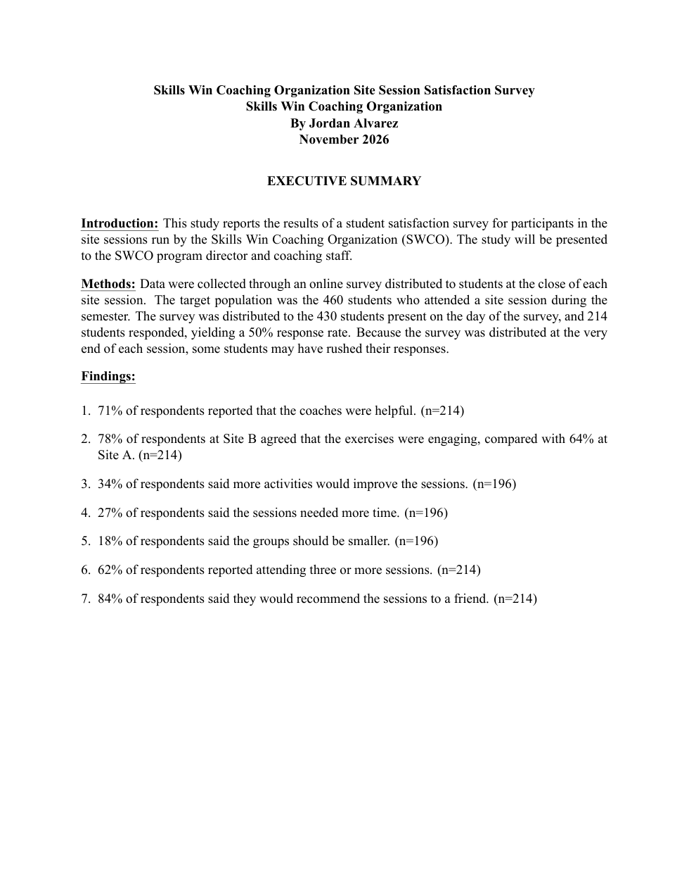

::: {.callout-note title="About these examples"}
The examples below use **sample data**. Skills Win Coaching Organization is a real
Syracuse University program, but the project, author, numbers, and responses shown
here are invented for teaching purposes and are not actual SWCO results.
:::

**Step 1:** Open a Word document. Create a header following the guidelines below.

{fig-alt="An executive summary header with callout labels: the project title, agency name, your name, and the month and year the project is due, each bold and centered, followed by one blank line and then EXECUTIVE SUMMARY in all caps and bold."}

*Note: The name of your project should describe in a few words the purpose of
your project.*

**Step 2:** Create the introduction by using information from your
[Organizational Assessment](../assignments/06-organizational-assessment.qmd). The first
sentences must be: "This study reports \_\_\_\_\_\_\_\_\_\_. The study will be
presented to \_\_\_\_\_\_\_\_\_."

The first sentence of the introduction in your executive summary should be
identical to the first sentence in the introduction section of your report.

{fig-alt="Example executive summary introduction: a bold underlined Introduction label followed by a short paragraph stating what the study reports and who it will be presented to."}

**Step 3:** Create the methods portion of your executive summary. Methods should
overview how data were collected and define the target population, sample, and
sampling frame, if applicable. Also in this section, note any MAJOR data
collection and accuracy issues.

Questions to answer in Methods:

- How was the data collected?
- What was your target population?
- What was your sample? What was your sampling frame if you had one?
- What were any major data collection or accuracy issues?

{fig-alt="Example executive summary methods paragraph giving the collection method, target population, sampling frame, sample size, response rate, and a note on accuracy."}

**Step 4:** Create the findings portion of your executive summary. Each of your
findings in this section should EXACTLY match the findings at the top of each of
your Findings pages throughout your report -- this means word for word. Be sure
every research question corresponds with a finding.

Reminders about findings:

- All findings should read "XX% of respondents reported..." OR "XX% of
  respondents said..."
- N (target population) vs. n (sample) -- use the correct case for parentheses
  after the finding
- "Findings" should be bold and underlined
- Numbers should be left justified and align with the "F" in "Findings"
- Sample size goes after the period in the parentheses
- Single-spaced within paragraphs, double-spaced between paragraphs

{fig-alt="Example executive summary findings: a bold underlined Findings label followed by a numbered list of finding statements, each giving a percentage and a sample size in parentheses."}

## Example executive summary

{fig-alt="A complete example executive summary page showing the centered bold header block, the EXECUTIVE SUMMARY title, and the Introduction, Methods, and numbered Findings sections."}
