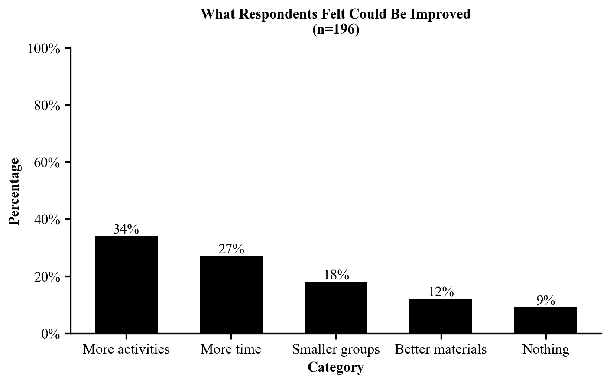

Each finding and the accompanying graph, source, and comment will have its own
page in the report.

**General layout of a findings page**

1. Finding statement
2. Graph
3. Source
4. Comment (if needed)
5. Page break

**Finding statement**

- Your first finding statement will go two lines below the "FINDINGS" header.
- Your finding statement should be numbered (for example, your fourth finding
  will start "4.").
- Do not include an indent anywhere in the finding statement.
- Do not include (n=) at the end of your finding statement in the Findings
  section. This is because (n=) should be included in your graph.
  - Note: you *will* include (n=) following your findings in the
    [Executive Summary](executive-summary.qmd).
- See class slides for how to write finding statements.

**Graph**

- You will copy and paste your graph below your finding statement.
- Graphs should be made in Excel.
- Follow the
  [PST 315 Graphing Guidelines](graphing.qmd)!
- Your graph should be centered on the page.
- **Do not insert a screenshot of your graph.**

**Source**

Below your graph you will type the source of your graph directly into the Word
document. The source should read something along the lines of: "Data collected by
John Doe and analyzed by Jane Doe for XYZ Organization, Community Link Project,
November 2025."

**Comment**

Some graphs will require a comment typed into Word below the source. This
includes aggregated graphs, open-ended response graphs, graphs where the
percentages do not add up to 100%, and graphs where you group multiple responses
into one category (including "other" categories).

**Page break**

To insert a new page, add a page break. **Do not add a section break.** Use
Insert → Page Break, and begin your next finding at the start of the next page.

## Example findings page

::: {.callout-note title="About this example"}
This example uses **sample data**. Skills Win Coaching Organization is a real
Syracuse University program, but the numbers shown are invented for teaching
purposes and are not actual SWCO results.
:::

The whole page -- statement, graph, source, and comment -- looks like this:

> 3. 34% of respondents said more activities would improve the site
>    sessions.

{fig-alt="Vertical bar graph titled What Respondents Felt Could Be Improved, n equals 196, with five solid black bars labeled with percentages."}

**Source:** Sample data collected and analyzed by Jordan Alvarez for the Skills Win Coaching Organization, Community Link Project, November 2026.

**Comment:** Respondents could give only one answer, so percentages total 100%.
Responses that named a specific activity were grouped into "More activities."
