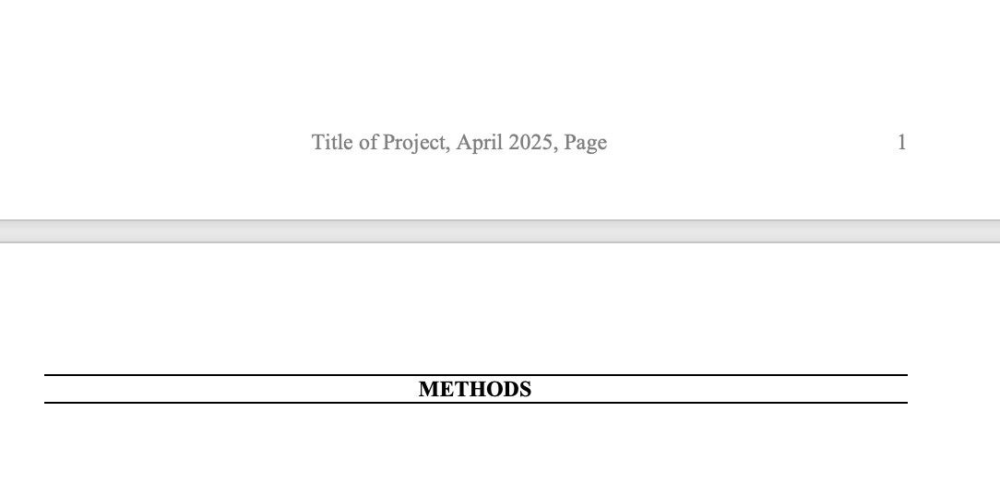
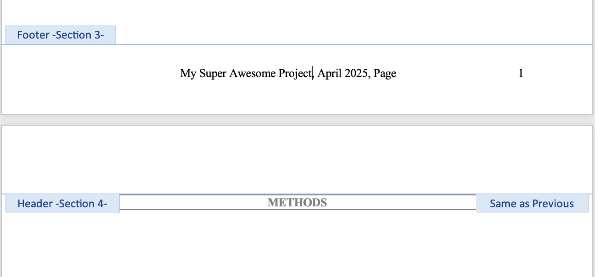
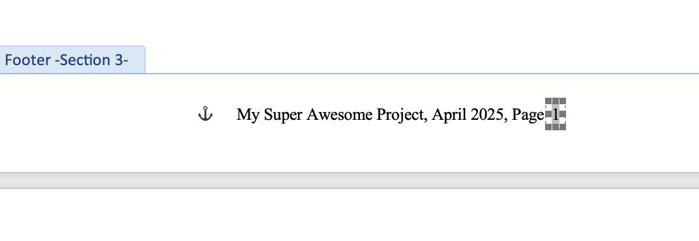
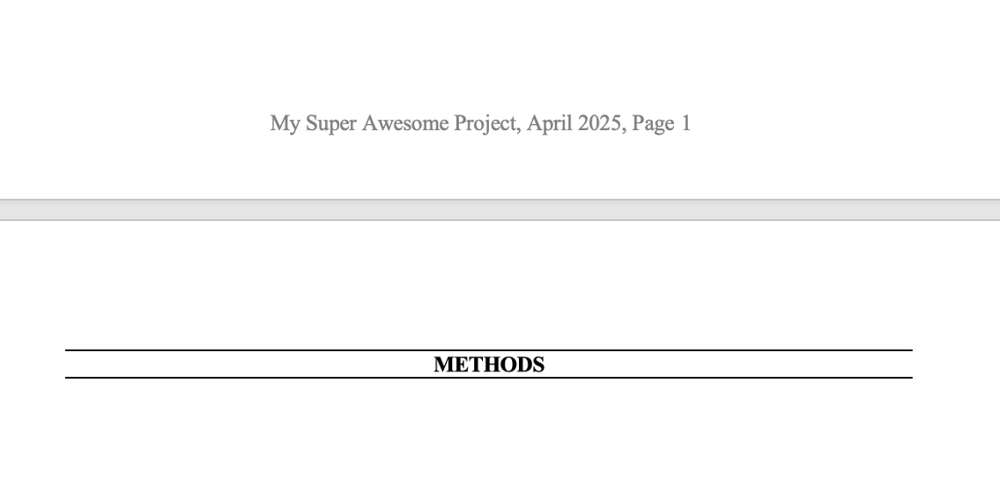
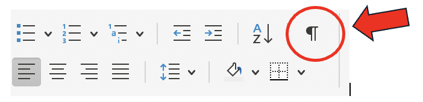
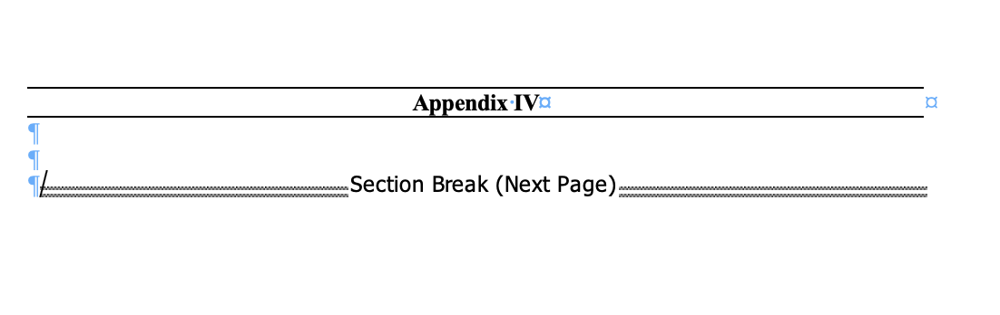
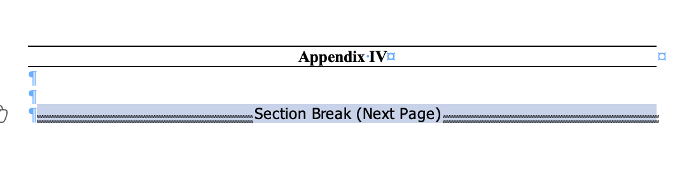
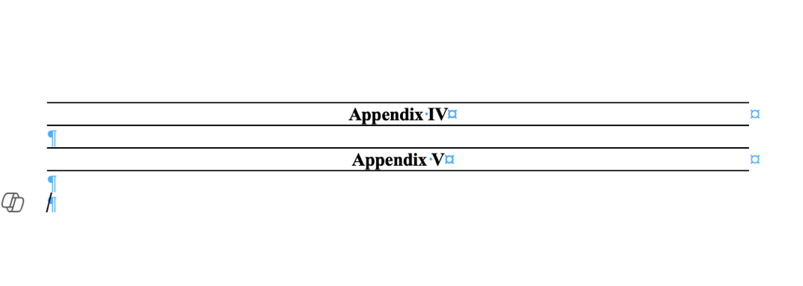

This guide covers editing footers, aligning page numbers, and deleting section
breaks.

## Editing the footer and aligning page numbers

The footer in the report shell will look like this:

{fig-alt="The default report shell footer showing placeholder project title and page number."}

Double click in the footer area, and then you should be able to edit the project
title. Change "Title of Project" to the actual title of your project.

{fig-alt="Editing the footer text in Word."}

Drag the page number box to align with the end of the footer.

{fig-alt="Dragging the page number box to align with the footer's right edge."}

All done!

{fig-alt="The completed footer with project title and aligned page number."}

## Deleting section breaks

Click on the paragraph button (find it on the Home menu, see the image below) to
show formatting marks on your report.

{fig-alt="The paragraph formatting-marks button on the Word Home ribbon."}

Once you click this you will see formatting marks appear in blue, and text in
black that shows section breaks and page breaks. Find the section break you want
to delete.

{fig-alt="A document with formatting marks visible, showing a section break."}

Click and press Command on your keyboard to select the section break. This will
highlight it.

{fig-alt="A section break selected and highlighted in Word."}

Press Command + X. This will cut the section break out of the report.

{fig-alt="The document after the section break has been cut."}

It should be gone. If not, try a few times -- it can be finicky!
