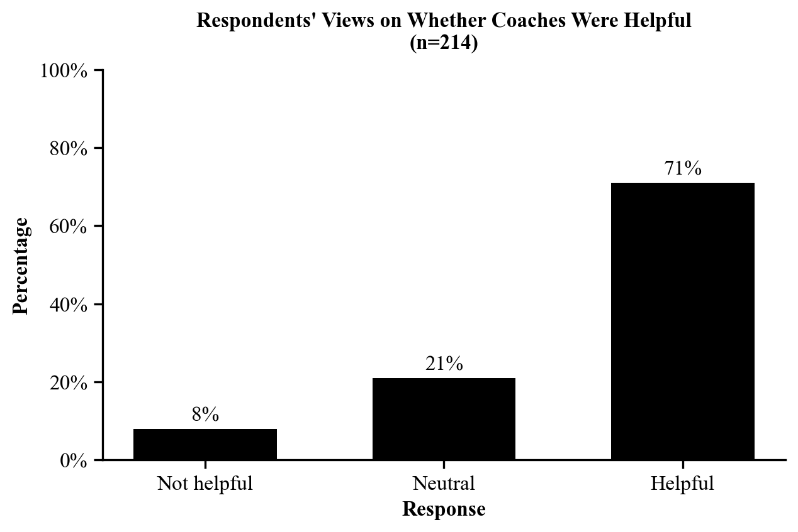

Every graph in your report must follow these guidelines.

**Graph type**

- Default to a **bar graph**. Do not use another type of graph (for example, a pie
  chart) without talking to your UCA or Professor.
- If there are 5 or fewer bars, arrange the bars vertically.
- If there are 6 or more bars, arrange the bars horizontally.

**Color**

- Everything is black -- no gray!
  - Be careful: Excel will sometimes default to a very dark gray.
- Bars are solid black.
- Axis lines are solid black.
- No borders on bars, and no extra shading on bars.
- No border on your graph.

**Text**

- ALL text is Times New Roman 12pt.
  - Double check your title is 12pt! When you update everything to TNR 12pt,
    sometimes the title will default back to a larger font. You may have to
    adjust the font size of your title a second time.
- Axis titles should be **bold**.
- The title should be **bold**.
- "n=sample size" should be under your title.

**Axes and data labels**

- The y-axis starts at 0.
- Use outside-end data labels. You will know this is done correctly if
  percentages display above your bars.
- Use major outside tick marks on your axis.

::: {.callout-important}
Copy and paste your graph into the report. **No screenshots!**
:::

## Example of a graph that follows the guidelines

::: {.callout-note title="About this example"}
This example uses **sample data**. Skills Win Coaching Organization is a real
Syracuse University program, but the numbers shown are invented for teaching
purposes and are not actual SWCO results.
:::

{fig-alt="Vertical bar graph titled Respondents' Views on Whether Coaches Were Helpful with n equals 214 beneath the title. Three solid black bars sit on a y-axis running from 0 to 100 percent, each labeled with its percentage above the bar. Axis titles are bold and there is no chart border."}

Check it against the list above: bar graph, three bars so arranged vertically,
solid black bars and axis lines, Times New Roman 12pt throughout, bold title and
bold axis titles, y-axis starting at 0, outside-end data labels showing
percentages, "n=" under the title, major outside tick marks, and no border.
