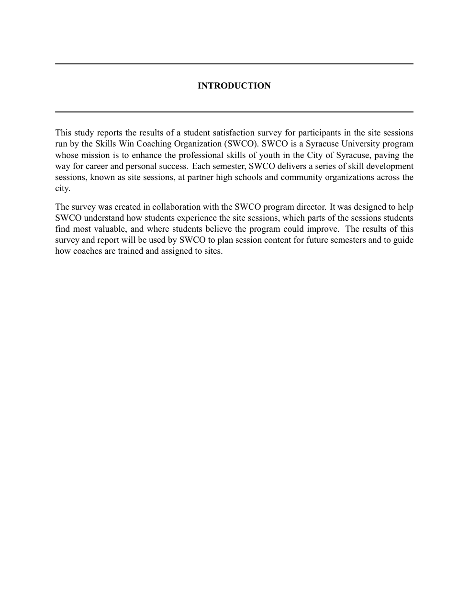
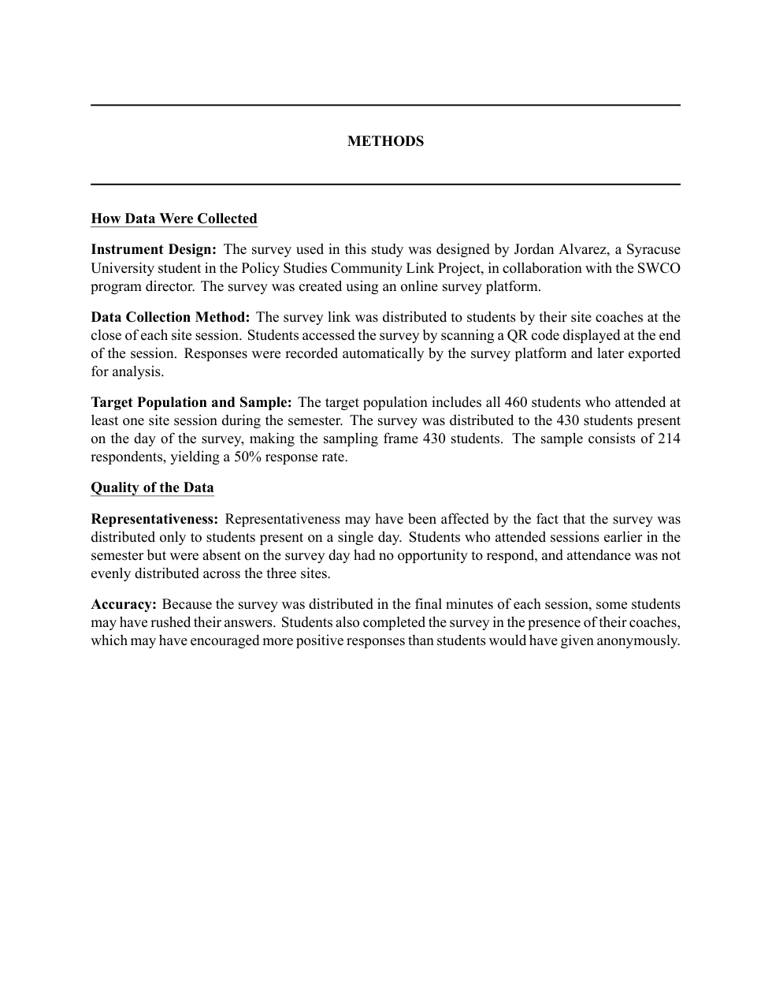

Your **Introduction** is where you will provide more details about your client's
organization and how your report will support their agency and mission. The first
sentence in your Introduction section should be identical to the first sentence
in your [Executive Summary](executive-summary.qmd).

Within your Introduction section, you should include information about your
client's organization from the
[Organizational Assessment](../assignments/06-organizational-assessment.qmd). This can include
the agency mission, services they provide in the community, or any other relevant
information about who they are as an organization. Then you should explain in a
few sentences what your report will be used for.

Your **Methods** section will be made up of two main parts: how data were
collected, and quality of the data. Within each part, there will be subsections
covering different topics important for your client and reader to understand
about the data.

## How data were collected

**Instrument design.** This section is where you will explain how the survey or
data was created. In this section, you will include details of who helped in the
creation of the survey or data as well as any platforms used to facilitate the
survey or data (for example, Google Forms).

**Data collection method.** This section provides information about timing of the
survey (open date, close date, any reminders), who sent out the survey, and how
and who recorded results. For data projects, this section will provide
information about how your client collected this data, when the data was
collected, and how you recorded the data.

**Target population and sample.** This section will include exact numbers (if
possible) for your target population, sampling frame, and sample. Additionally,
if applicable, record a response rate here.

## Quality of the data

**Representativeness.** This section will explain any threats your project
experienced with representativeness. As a reminder, when thinking about
representativeness, ask yourself: "How well does the sample reflect the target
population?" Some (but not all) potential threats to representativeness could be
a small sample, selection bias, or non-random selection.

**Accuracy.** This section will describe any potential accuracy threats your
project experienced. As a reminder, when thinking about accuracy, ask yourself:
"Does the data reflect reality?" You can never be certain your data is 100%
accurate. Some potential accuracy threats to survey projects are respondents
having motivated bias, respondents not understanding questions or unclear
questions, or mistakes in transferring and recording data. Some potential
accuracy threats to data projects are mistakes in recording, incomplete or messy
records, and biased record keepers.

::: {.callout-note title="About these examples"}
The example pages below use **sample data**. Skills Win Coaching Organization is a
real Syracuse University program, but the project, author, and numbers shown are
invented for teaching purposes and are not actual SWCO results.
:::

## Example introduction page

{fig-alt="A complete example Introduction page: the INTRODUCTION section header between two rules, followed by two paragraphs describing the client organization and what the report will be used for."}

## Example methods page

{fig-alt="A complete example Methods page with underlined How Data Were Collected and Quality of the Data headings, and bold sub-labels for Instrument Design, Data Collection Method, Target Population and Sample, Representativeness, and Accuracy."}
